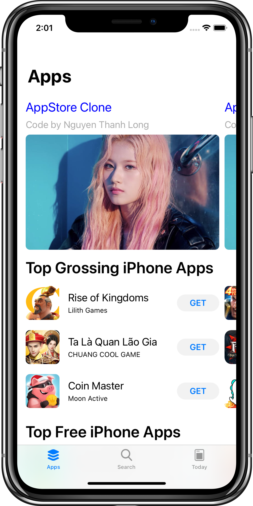
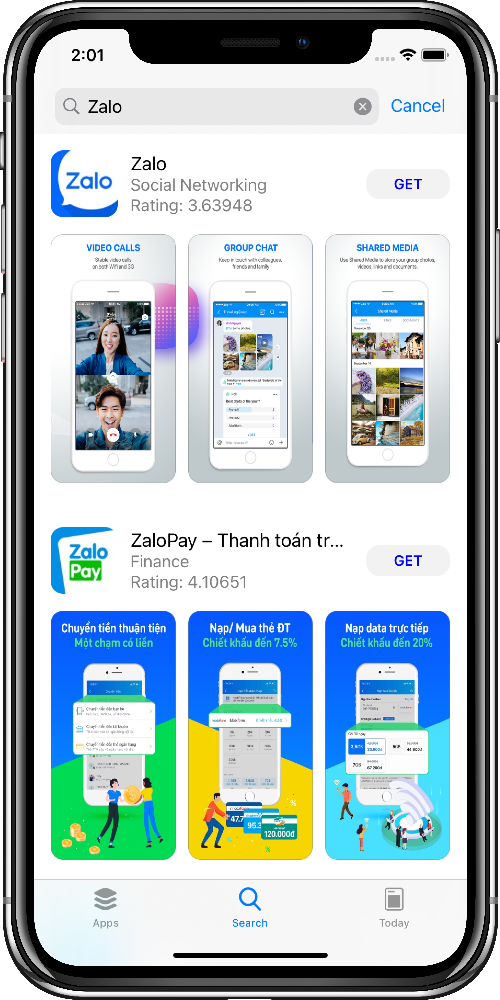

## About Project

This is just an iOS AppStore Clone App.

## Technologies

- Swift 5
- Xcode 12.0.1
- JSON APIs coming directly from [Apple's iTunes Search API](https://affiliate.itunes.apple.com/resources/documentation/itunes-store-web-service-search-api/)
- Cocoapods 1.9.3
- Fetch image from Url by [SDWebImage](https://github.com/SDWebImage/SDWebImage)
- Design Pattern: MVC

## Task Lists

- [x] UI: Search Screen 
- [x] UI: App Screen 
- [ ] UI: Today Screen
- [x] Search app
- [X] App Details

## Screenshots

  
  
  

